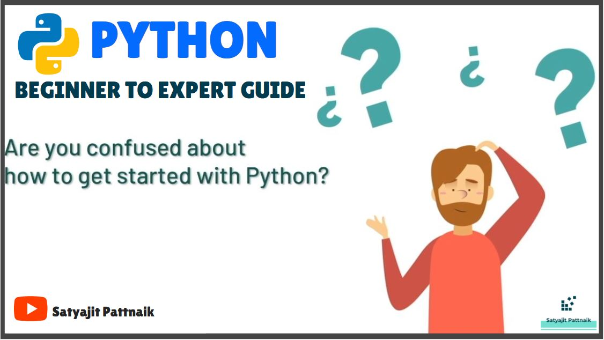

# PYTHON - BASIC TO INTERMEDIATE PROGRAM

Complete Python Tutorial - Beginners to Expert Program

## Playlist link: https://www.youtube.com/playlist?list=PLymcv5WXEpKh6uK1ak5-ReqTluWdSEK2p

Here’s a list of topics covered in this playlist/tutorial:

1.       Introduction to Python 
2.       Basics of Python 
3.       Python Data Structures 
4.       Python Loops, Functions, & File Handling
5.       Python Exception Handling 
6.       Iterators & Generators 
7.       Python for Data Science - We're here.

Keep following my videos to get quality content on Python, Statistics, Machine Learning, Deep Learning, Data Science, AI & various other related topics.

